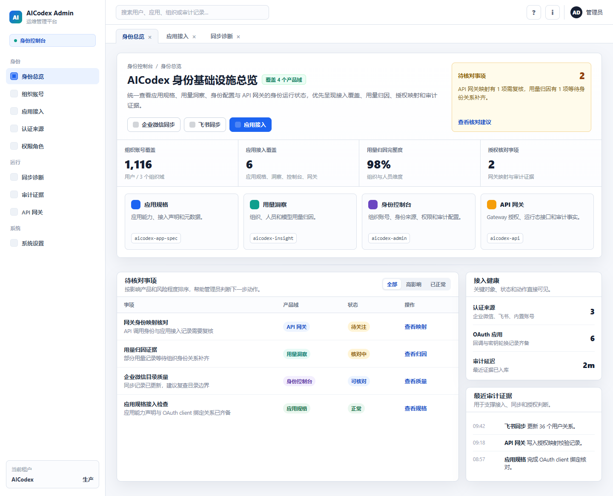

# AICodex 身份基础设施总览确认稿

本确认稿用于 `aicodex-admin` 身份控制台首页首屏。页面用户可见域名为“身份控制台”，首页标题为“AICodex 身份基础设施总览”，面包屑为“身份控制台 / 身份总览”。

## 设计稿

源确认稿来自本任务主控确认的桌面预览：`2026-06-19-admin-overview-aicodex-infra-mockup-v2`。仓库内以本 PNG 和本文档作为后续实现、验收和回归对照，不依赖本地 vault 路径。

## 首屏结构

- 主体围绕 4 个 AICodex 产品域展开，用户可见主标签使用业务名，仓库名只作为二级 code tag：`应用规格 / aicodex-app-spec`、`用量洞察 / aicodex-insight`、`身份控制台 / aicodex-admin`、`API 网关 / aicodex-api`。
- 首屏优先展示身份运行状态、接入覆盖、用量归因、授权映射、待核对事项和审计证据。
- `身份资产关系`、`治理任务中心`、`接入预检中心` 等不作为总览显眼入口堆叠；需要保留时只能作为低噪的页面上下文链接或状态卡动作。
- 没有真实后端处理状态时，不使用“待处理”；使用“待核对”“待关注”“核对中”“正常”等更准确状态。
- 总览不显示内部设计术语或实现痕迹，例如“国内云控制台式密度”“对象上下文”“deep link”“只读推导”“当前列表视图”等。

## 实现对照

- 左侧第一个一级菜单为“身份总览”。如壳层仍存在二级菜单结构，只有一个子项时应收敛为一级项显示。
- 不新增独立“快捷操作”菜单入口；高频动作放在页面标题区或对应状态/证据上下文中。
- 首屏信息密度应接近管理控制台：状态摘要、产品域卡、待核对事项表、接入健康和审计证据在 1440px 桌面首屏内形成完整判断路径。
- 移动端以单列流式布局为准，页面不得出现横向溢出或过高顶部空白。
