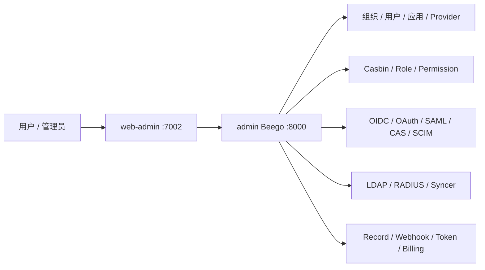
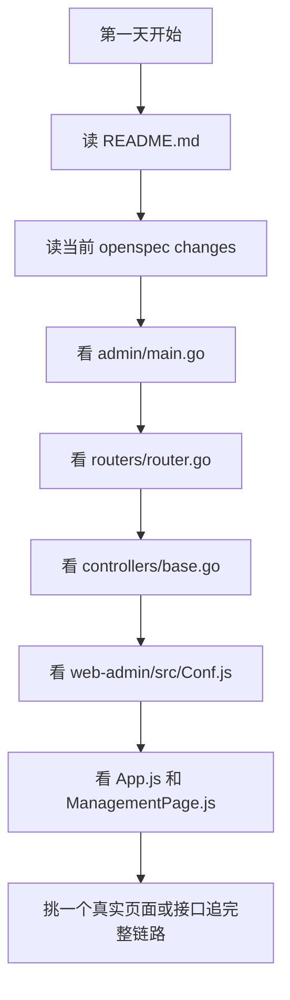

# 新开发者快速入门

本文面向刚加入 `aicodex-admin` 的开发者，目标是帮助你快速建立项目心智模型，知道第一天应该先读哪些文件、怎么跑起来、以及哪些边界不要一开始就踩错。

## 1. 先用一句话理解项目

`aicodex-admin` 是 AICodex 平台的“认证中心 + 管理后台”。

它负责身份认证、授权、用户与组织、应用接入、第三方登录源、Casbin 权限、LDAP/RADIUS、Token、资源、审计记录、Webhook、计费订阅等管理能力。它不是模型请求网关，也不是模型协议转发层；模型渠道、转发、配额、网关数据面主要应先看 `aicodex-api`。

项目总说明见 [`README.md`](../README.md)。

## 2. 最重要的五个心智模型

### 2.1 这是认证与管理控制面

默认可以这样区分：

- `aicodex-admin`：认证中心、用户与组织、应用、Provider、权限、管理后台。
- `aicodex-api`：AI 网关、模型渠道、协议适配、请求路由、数据面执行。

二者都属于 AICodex 平台，但职责不同。排查登录、用户、应用、企业微信、OIDC、Casbin、LDAP、后台菜单时，优先看本仓库；排查模型调用转发时，优先看网关仓库。



### 2.2 它基于 Casdoor 体系改造

代码中仍保留大量 Casdoor 体系的领域对象、协议能力和版权头，例如：

- `Organization`、`User`、`Application`、`Provider`
- `Role`、`Permission`、`Enforcer`、`CasbinRule`
- OAuth/OIDC、SAML、CAS、SCIM、WebAuthn、MFA
- LDAP、RADIUS、Syncer、Webhook、Resource、Cert、Key

当前改造重点是把它收敛为 AICodex 的认证中心和后台壳层，例如品牌、默认中文、左侧导航、企业微信登录入口等。阅读时不要把这些 Casdoor 命名都当成“遗留错误”，它们大多是现有模型和兼容边界。

### 2.3 后端是 Beego 单体服务

后端入口是 [`admin/main.go`](../admin/main.go)，主要启动顺序是：

1. 初始化 session，默认 cookie 名为 `aicodex_admin_session_id`。
2. 装配 API 路由：[`admin/routers/router.go`](../admin/routers/router.go)。
3. 读取配置、初始化数据库适配器、建表、加载初始化数据。
4. 初始化存储、LDAP 同步、HTTP client、Casbin、用户管理、Token 清理、站点监控。
5. 注册静态资源、CORS、超时、API 鉴权、Prometheus、请求记录、字段校验等过滤器。
6. 启动 LDAP、RADIUS、Webhook delivery worker。
7. 监听 `httpport`，默认是 `8000`。

请求链路通常按这个方向追：

`routers -> filters -> controllers -> object / service / idp / authz`

### 2.4 前端是 React 管理后台壳层

前端在 [`web-admin/`](../web-admin)，技术栈是 React 18、Ant Design 5、CRACO、`react-router-dom` v5、i18next。

几个入口最关键：

- [`web-admin/src/App.tsx`](../web-admin/src/App.tsx)：应用入口、登录/回调/后台路由的外层装配。
- [`web-admin/src/ManagementPage.tsx`](../web-admin/src/ManagementPage.tsx)：认证中心后台壳层、顶部工具区、左侧菜单、主要页面路由。
- [`web-admin/src/Conf.ts`](../web-admin/src/Conf.ts)：品牌、默认语言、主题、静态资源等前端默认配置。
- [`web-admin/src/auth/LoginPage.tsx`](../web-admin/src/auth/LoginPage.tsx)：登录页主入口。
- [`web-admin/src/auth/Provider.tsx`](../web-admin/src/auth/Provider.tsx)：第三方登录 Provider 发起逻辑。
- [`web-admin/src/auth/AuthCallback.tsx`](../web-admin/src/auth/AuthCallback.tsx)：OAuth/企业微信等回调落地。
- [`web-admin/src/backend/`](../web-admin/src/backend)：前端调用后端 API 的封装。

### 2.5 OpenSpec 是当前需求脉络

本仓库已有 [`openspec/`](../openspec) 用来记录较大的产品和架构改动。新人不用一开始读完所有规格，但要先区分 active change 和已经归档/固化的主规格：

- 运行 `openspec list` 查看当前仍在推进的 active change，不要根据历史文档猜测。
- [`openspec/specs/admin-enterprise-identity-console-shell/spec.md`](../openspec/specs/admin-enterprise-identity-console-shell/spec.md)：认证中心后台壳层、左侧导航、工作区和响应式行为。
- [`openspec/specs/admin-login-entry-routing/spec.md`](../openspec/specs/admin-login-entry-routing/spec.md)：登录、OAuth/OIDC 授权入口和回调路由边界。
- [`openspec/specs/wecom-homepage-signin/spec.md`](../openspec/specs/wecom-homepage-signin/spec.md) 与 [`openspec/specs/wecom-provider-configuration/spec.md`](../openspec/specs/wecom-provider-configuration/spec.md)：企业微信首页扫码登录和后台 Provider 配置。

如果你要改登录、Provider、后台壳层、导航、默认语言，先读对应主规格；只有 `openspec list` 中仍显示 active change 时，才继续读该 change 的 `proposal.md`、`design.md` 和 `tasks.md`。

## 3. 仓库结构怎么读

### 3.1 根目录

- [`admin/`](../admin)：Go Beego 后端服务。
- [`web-admin/`](../web-admin)：React 管理后台。
- [`deploy/`](../deploy)：Docker、Compose、Kubernetes、运行配置模板。
- [`openspec/`](../openspec)：需求、设计、任务与规格变更工件。
- [`designs/`](../designs)：品牌和图标资源。

### 3.2 后端重点目录

- [`admin/routers/`](../admin/routers)：路由和过滤器。
- [`admin/controllers/`](../admin/controllers)：API 控制器、响应封装、登录和管理接口。
- [`admin/object/`](../admin/object)：核心领域对象、数据库适配、表结构同步、初始化数据。
- [`admin/service/`](../admin/service)：后台服务编排和周期任务。
- [`admin/idp/`](../admin/idp)：第三方身份源，例如企业微信、GitHub、Google 等。
- [`admin/authz/`](../admin/authz)：Casbin 权限初始化和执行。
- [`admin/ldap/`](../admin/ldap)、[`admin/radius/`](../admin/radius)：目录服务和网络认证服务。
- [`admin/mcpself/`](../admin/mcpself)：本服务暴露的 MCP 接口。

### 3.3 前端重点目录

- [`web-admin/src/auth/`](../web-admin/src/auth)：登录、回调、Provider 登录按钮与扫码入口。
- [`web-admin/src/backend/`](../web-admin/src/backend)：请求封装。
- [`web-admin/src/basic/`](../web-admin/src/basic)：基础布局和通用 UI。
- [`web-admin/src/locales/`](../web-admin/src/locales)：国际化文案。
- [`web-admin/src/provider/`](../web-admin/src/provider)：Provider 相关前端能力。
- `web-admin/src/*ListPage.js`、`web-admin/src/*EditPage.js`：后台大多数列表页和编辑页都沿用这套命名。

## 4. 你最可能接触的几类开发工作

### 4.1 登录与第三方身份源

优先看：

- [`web-admin/src/auth/LoginPage.js`](../web-admin/src/auth/LoginPage.js)
- [`web-admin/src/auth/Provider.js`](../web-admin/src/auth/Provider.js)
- [`web-admin/src/auth/AuthCallback.js`](../web-admin/src/auth/AuthCallback.js)
- [`web-admin/src/ProviderEditPage.js`](../web-admin/src/ProviderEditPage.js)
- [`admin/idp/`](../admin/idp)
- [`admin/controllers/auth.go`](../admin/controllers/auth.go)

企业微信当前主交付路径是 `WeCom + Internal + Normal` 的 OAuth2 `snsapi_privateinfo` 敏感授权二维码。后台 Provider 里需要配置 `Corp ID`、`Secret`、`Agent ID`，主链路回调使用实际登录域名下的 `/api/wecom-profile-consent/callback`；旧 PC Web 登录组件仅作为兼容 fallback，不承诺返回手机号、邮箱或头像。

### 4.2 用户、组织、应用管理

优先看：

- [`admin/controllers/`](../admin/controllers)
- [`admin/object/user.go`](../admin/object/user.go)
- [`admin/object/organization.go`](../admin/object/organization.go)
- [`admin/object/application.go`](../admin/object/application.go)
- [`web-admin/src/UserListPage.js`](../web-admin/src/UserListPage.js)
- [`web-admin/src/OrganizationListPage.js`](../web-admin/src/OrganizationListPage.js)
- [`web-admin/src/ApplicationListPage.js`](../web-admin/src/ApplicationListPage.js)

### 4.3 权限与 Casbin

优先看：

- [`admin/authz/`](../admin/authz)
- [`admin/object/role.go`](../admin/object/role.go)
- [`admin/object/permission.go`](../admin/object/permission.go)
- [`admin/object/enforcer.go`](../admin/object/enforcer.go)
- [`web-admin/src/RoleListPage.js`](../web-admin/src/RoleListPage.js)
- [`web-admin/src/PermissionListPage.js`](../web-admin/src/PermissionListPage.js)
- [`web-admin/src/EnforcerListPage.js`](../web-admin/src/EnforcerListPage.js)

### 4.4 后台壳层、菜单和品牌

优先看：

- [`web-admin/src/ManagementPage.js`](../web-admin/src/ManagementPage.js)
- [`web-admin/src/App.js`](../web-admin/src/App.js)
- [`web-admin/src/Setting.js`](../web-admin/src/Setting.js)
- [`web-admin/src/Conf.js`](../web-admin/src/Conf.js)
- [`web-admin/src/i18n.js`](../web-admin/src/i18n.js)
- [`web-admin/public/`](../web-admin/public)

### 4.5 部署和运行配置

优先看：

- [`deploy/app.conf`](../deploy/app.conf)
- [`deploy/docker-compose.yml`](../deploy/docker-compose.yml)
- [`deploy/Dockerfile`](../deploy/Dockerfile)
- [`deploy/k8s.yaml`](../deploy/k8s.yaml)
- [`Makefile`](../Makefile)

配置读取支持环境变量覆盖。数据库、端口、Redis session、默认语言、静态资源、LDAP/RADIUS 端口都在这里排查。

## 5. 第一天建议怎么上手

建议按下面顺序：

1. 先读 [`README.md`](../README.md)，建立项目定位。
2. 看两个当前 OpenSpec change：企业微信登录、认证中心壳层。
3. 打开 [`admin/main.go`](../admin/main.go)，理解后端启动和初始化顺序。
4. 打开 [`admin/routers/router.go`](../admin/routers/router.go)，扫一遍 API 能力面。
5. 打开 [`admin/controllers/base.go`](../admin/controllers/base.go)，理解 session、管理员判断和响应包装。
6. 打开 [`web-admin/src/Conf.js`](../web-admin/src/Conf.js)，理解品牌、语言、主题默认值。
7. 打开 [`web-admin/src/App.js`](../web-admin/src/App.js) 和 [`web-admin/src/ManagementPage.js`](../web-admin/src/ManagementPage.js)，理解前端路由和后台壳层。
8. 根据你要负责的方向，从一个真实页面或接口沿链路追到后端对象层。



## 6. 本地运行最短路径

### 6.1 后端

后端按 [`admin/go.mod`](../admin/go.mod) 使用 Go `1.25`，并声明 toolchain `go1.25.8`。

如果你本机已有可用 MySQL，并且账号符合 [`deploy/app.conf`](../deploy/app.conf) 的默认值：

```powershell
cd admin
go test ./...
go run ./main.go -config ../deploy/app.conf -createDatabase=true
```

如果你更想用 Compose 里的 PostgreSQL，只启动数据库后用环境变量覆盖配置：

```powershell
docker compose -f deploy/docker-compose.yml up -d db

$env:driverName = "postgres"
$env:dbName = "aicodex_admin"
$env:dataSourceName = "user=postgres password=<your-postgres-password> host=localhost port=5432 sslmode=disable dbname=aicodex_admin"

cd admin
go run ./main.go -config ../deploy/app.conf -createDatabase=true
```

后端默认监听 `8000`。前端开发代理也默认指向 `http://localhost:8000`。

### 6.2 前端

`web-admin` 强制使用 Bun 1.3.14 和 tracked `bun.lock` 安装依赖：

```powershell
cd web-admin
bun run deps:install
bun run start
```

Windows日常开发必须使用默认持久cache，执行前取消 `BUN_INSTALL_CACHE_DIR`；统一入口在Windows运行普通install，在Linux CI/Docker运行frozen install。Windows显式空custom cache的首次物化可能触发Bun 1.3.14已知的 `EPERM`/`ENOENT`，这不是标准安装方式。

开发服务默认端口是 `7002`。CRACO 代理配置在 [`web-admin/craco.config.js`](../web-admin/craco.config.js)，会把 `/api`、`/swagger`、`/files`、OIDC discovery、CAS、SCIM 等请求转发到后端 `8000`。

常用检查：

```powershell
cd admin
go test ./...

cd ../web-admin
bun run build
```

### 6.3 Docker Compose

如果已经有 `aicodex-admin:latest` 镜像：

```powershell
docker compose -f deploy/docker-compose.yml up -d
```

Compose 会启动：

- `aicodex-admin`：监听 `8000`
- `db`：PostgreSQL，监听 `5432`

镜像构建可参考 [`README.md`](../README.md) 和 [`deploy/build_image.sh`](../deploy/build_image.sh)。

## 7. 新人最容易踩的点

- 不要把本仓库当成 `aicodex-api`。这里主要是身份、权限、管理后台，不是模型转发网关。
- 不要看到 Casdoor 命名就急着清理。很多命名背后是协议兼容、数据库模型或上游 SDK 约束。
- 改登录和 Provider 时，前端发起参数、后端 `idp` 实现、回调 URL、企业微信后台可信域名必须同时对齐。
- `web-admin` 的 `preinstall` 会拒绝Yarn/npm；安装依赖统一使用Bun 1.3.14的 `bun run deps:install`。Windows复用默认持久cache并执行普通install，Linux CI/Docker执行frozen install，两端都校验lock与完整依赖tree。
- 本地启动后端会同时启动 LDAP/RADIUS；如果端口冲突，先看 `deploy/app.conf` 里的 `ldapServerPort`、`ldapsServerPort`、`radiusServerPort`。
- 语言默认值可能被前端配置、服务端 web config、cookie、本地存储或 URL 参数覆盖。排查语言问题时同时看 `Conf.js`、`i18n.js`、`deploy/app.conf`。
- 后端 session 默认是 file provider，配置 `redisEndpoint` 后切到 Redis。登录态问题先看 session provider、cookie 名、域名和 SameSite。
- 数据库表由 `object.CreateTables()` 通过 Xorm 同步。改领域对象时要评估已有数据、兼容性和初始化数据。
- 涉及后台壳层、企业微信、默认语言这类较大行为改动时，先看 `openspec/changes/`，不要只跟着页面文件局部改。

## 8. 建议你的第一个熟悉动作

选一条你后续最可能维护的真实链路完整走一遍：

- 企业微信登录：`LoginPage -> WeComLoginPanel -> /api/wecom-profile-consent/* -> controllers/wecom_profile_consent.go -> idp/wecom_internal.go -> object/wecom_profile_consent*.go`
- 用户管理：`UserListPage -> backend/UserBackend -> controllers/user -> object/user`
- 应用接入：`ApplicationListPage -> ApplicationEditPage -> controllers/application -> object/application`
- 权限管理：`Role/Permission/Enforcer 页面 -> controllers -> authz/object`

把页面入口、请求路径、控制器方法、对象模型、配置项和验证方式串起来，比孤立读文件更快形成全局感。
