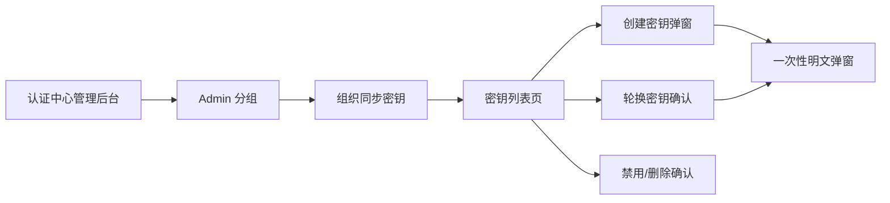
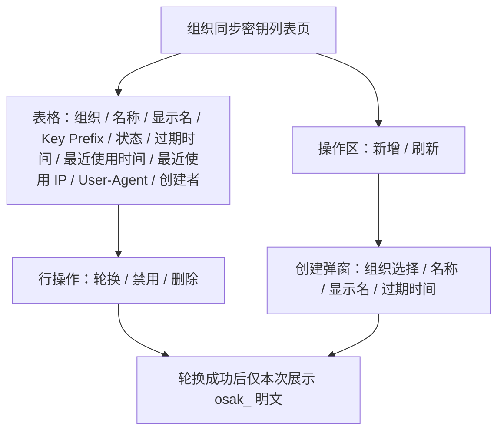

# 组织同步密钥 UI 设计图

## 页面入口

```mermaid
flowchart LR
  A["认证中心管理后台"] --> B["Admin 分组"]
  B --> C["组织同步密钥"]
  C --> D["密钥列表页"]
  D --> E["创建密钥弹窗"]
  D --> F["轮换密钥确认"]
  D --> G["禁用/删除确认"]
  E --> H["一次性明文弹窗"]
  F --> H
```

## 列表布局

```mermaid
flowchart TB
  P["组织同步密钥列表页"]
  P --> T["表格：组织 / 名称 / 显示名 / Key Prefix / 状态 / 过期时间 / 最近使用时间 / 最近使用 IP / User-Agent / 创建者"]
  P --> A["操作区：新增 / 刷新"]
  T --> R["行操作：轮换 / 禁用 / 删除"]
  R --> S["轮换成功后仅本次展示 osak_ 明文"]
  A --> C["创建弹窗：组织选择 / 名称 / 显示名 / 过期时间"]
  C --> S
```

## 交互约束

- 创建时必须选择非 `built-in` 业务组织。
- 创建和轮换只在成功响应后展示一次 `osak_` 明文。
- 列表只展示 `keyPrefix` 和审计字段，不展示明文或哈希。
- 禁用后保留审计记录，删除会移除该 Key 元数据。
