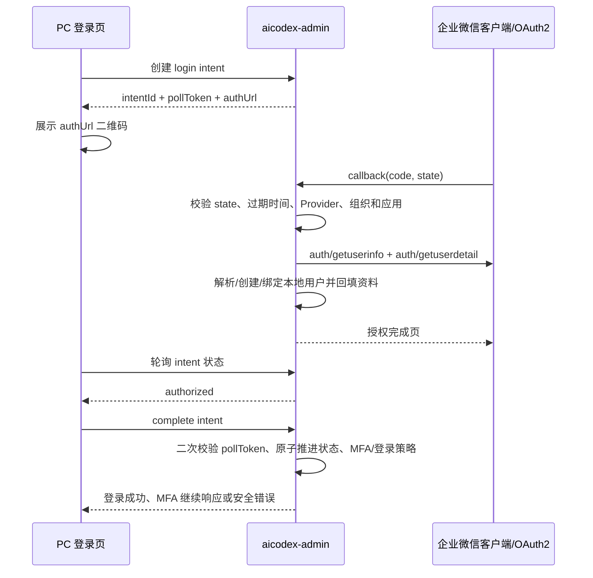

## Context

上一轮 `fix-wecom-login-profile-fields` 已经证明两件事：

- `aicodex-admin` 在企业微信返回 `mobile`、`email`、`biz_mail`、`avatar` 后，可以把字段映射到 `idp.UserInfo` 并按“只补空值”策略落到本地用户。
- PC Web 扫码 SSO 即使携带 `scope=snsapi_privateinfo`，也不稳定触发敏感资料授权确认，因此不能作为补齐邮箱、手机号和头像的主路径。

企业微信 OAuth2 网页授权的 `snsapi_privateinfo` 是更合适的主路径：用户用企业微信客户端打开授权链接并确认后，后端可通过 `auth/getuserinfo` 获取 `user_ticket`，再通过 `auth/getuserdetail` 获取手机号、邮箱、企业邮箱和头像等敏感字段。PC 登录页无法直接承接手机端回调，所以需要增加“一次性授权意图”作为 PC 页面和手机授权回调之间的桥。

参考入口：企业微信开发者中心的“身份验证 / 网页授权登录 / 获取访问用户敏感信息”文档，当前官方文档索引地址为 `https://developer.work.weixin.qq.com/document/path/90238`。

## Goals / Non-Goals

**Goals:**

- 把企业微信登录主链路从 PC Web 扫码组件切到 OAuth2 `snsapi_privateinfo` 敏感授权二维码。
- PC 登录页创建一次性登录意图，展示企业微信 OAuth2 授权二维码，轮询授权结果，并由 PC 端完成本地登录 session。
- 手机端授权回调只负责换取企业微信用户资料、解析本地用户和写入意图结果，不直接建立 PC session。
- 已登录用户可主动发起“同步企业微信资料”，再次扫码授权后补齐邮箱、手机号和头像。
- 复用现有企业微信 IdP 字段映射、OAuth 用户匹配、`SetUserOAuthProperties()` 和头像持久化逻辑。
- 保留现有 PC Web 登录组件作为兼容 fallback，但不再把它作为敏感资料获取主路径。

**Non-Goals:**

- 不重写全部 Casdoor OAuth 登录架构。
- 不扩展企业微信第三方服务商登录。
- 不绕过企业微信授权，不从姓名、部门或已有通讯录数据推断敏感资料。
- 不覆盖本地已有邮箱和手机号；本地已有值的纠错覆盖策略后续单独设计。
- 不把真实环境地址、企业标识、AgentId、Secret、授权码、token、手机号或邮箱写入文档、日志或测试固件。

## Decisions

### 1. 主路径使用 OAuth2 敏感授权二维码，不再依赖 WwLogin 获取敏感字段

PC 登录页创建登录意图后，后端返回 OAuth2 授权 URL：

```text
https://open.weixin.qq.com/connect/oauth2/authorize
  ?appid=<CorpID>
  &redirect_uri=<encoded backend callback>
  &response_type=code
  &scope=snsapi_privateinfo
  &state=<one-time-state>
  &agentid=<AgentId>
  #wechat_redirect
```

前端使用现有 Ant Design `QRCode` 渲染该 URL。用户必须用企业微信客户端扫码授权；普通浏览器打开时可能只提示“请在企业微信客户端打开链接”，这是企业微信平台限制，不作为本地代码错误。

现有 `WeComLoginPanel` 中加载 `WwLogin` 的 PC Web 组件保留为 fallback，例如“兼容网页登录”或配置项控制的备用入口。fallback 只保证能完成企业微信身份登录，不承诺返回 `user_ticket`、邮箱、手机号或头像。

### 2. 用数据库保存一次性授权意图

授权意图需要跨 PC 页面、手机回调、后端重启和未来多实例部署共享状态，因此不使用纯内存 map。新增对象建议命名为 `WecomProfileConsentIntent`，由 Xorm 在启动时 `Sync2` 自动建表。

建议核心字段：

| 字段 | 说明 |
| --- | --- |
| `owner` / `name` | 沿用对象层主键，`owner` 为目标组织，`name` 为随机意图 ID |
| `created_at` / `updated_at` / `expires_at` / `completed_at` | 使用 `time.Time`，应用层按 UTC 写入 |
| `intent_type` | `login` 或 `profile_sync` |
| `status` | `pending`、`authorized`、`mfa_pending`、`completed`、`expired`、`failed` |
| `organization` / `application` | 登录或同步所属组织和应用 |
| `provider_owner` / `provider_name` | 使用的企业微信 Provider |
| `corp_id` / `agent_id` | 用于回调边界校验和排查，不能存 Secret |
| `login_context_json` | 登录入口上下文快照，只保存兼容现有登录所需的非敏感参数，例如 `type`、`clientId`、`responseType`、`redirectUri`、`scope`、`state`、`nonce`、`codeChallenge`、`challengeMethod`、`resource`、`casService` |
| `state_nonce_hash` | 校验企业微信回调 `state`，不明文存储 nonce |
| `poll_token_hash` | PC 轮询和完成登录的客户端凭证，不明文存储 |
| `client_key_hash` / `client_ip_hash` | 防滥用、复用未过期意图和排查异常请求，只保存哈希或脱敏摘要 |
| `failed_attempt_count` | 轮询、complete 或回调校验失败次数，达到阈值后可标记 `failed` |
| `subject_owner` / `subject_name` | `profile_sync` 时的当前登录用户 |
| `expected_wecom_user_id` | 主动同步时必须匹配的企业微信 userid |
| `resolved_user_owner` / `resolved_user_name` | 手机授权后解析出的本地用户 |
| `wecom_user_id` | 手机授权返回的企业微信 userid |
| `return_url` | PC 登录完成后的目标页面，只允许相对路径或已允许 redirect URI |
| `error_code` / `error_text` | 脱敏错误分类和摘要 |

`state` 建议只包含意图 ID 和随机 nonce，例如 `base64url(intentName.nonce)`；nonce 只保存哈希值。`pollToken` 只通过请求头或 POST body 传递，不放在 URL query，降低被代理和访问日志记录的风险。

不保存企业微信 `code`、`access_token`、`user_ticket`、明文手机号、明文邮箱或 Secret。登录上下文只保存当前 Casdoor 登录入口所需的非敏感参数，不重复保存企业微信授权码或外部 token。企业微信回调中拿到的授权码只在当前请求内使用；换取到的资料通过现有用户属性和本地用户字段保存。

意图默认短时有效，建议首版 5 分钟。`completed`、`failed`、`expired` 的历史记录可保留短期用于排查，并通过后台任务或登录创建时顺手清理过期记录。

### 3. 公开创建意图接口必须防滥用

`login-intents` 是公开接口，且会写数据库。它不能只依赖 `state` 和短过期时间来兜底，首版必须加上低成本防滥用策略：

- 按客户端 IP、客户端键、应用、Provider 做短窗口限流，超过阈值返回安全错误。
- `client_key_hash` 优先来自服务端设置的短期匿名 cookie；没有 cookie 时退化为 IP、User-Agent 和应用维度的脱敏组合键。
- 同一 `client_key_hash`、同一应用、同一 Provider 在未过期且仍为 `pending` 时，优先复用或替换旧意图，不允许无限制堆积。
- 单次创建前顺手清理该客户端或该应用下已过期的 `pending` 意图。
- 查询和 complete 接口失败次数异常时，允许把意图标记为 `failed`，阻断继续轮询或消费。
- 限流和错误日志只记录摘要，不记录 `pollToken`、`state` 明文、授权码或敏感资料。

这不是完整的风控系统，但足以避免匿名请求把意图表刷成大量无效记录。

### 4. 登录流程拆成 callback 和 PC complete 两段

手机端回调不能直接给 PC 浏览器写 session。登录流程设计为：



回调阶段必须完成 OAuth 用户处理的“数据侧”动作：Provider 解析、企业微信用户资料获取、本地用户匹配、注册/绑定限制判断、必要的新用户创建、`SetUserOAuthProperties()` 回填和意图结果写入。原因是授权 `code`、`user_ticket` 和 token 不落库，PC `complete` 阶段不能也不应该重新换取敏感资料。

创建登录意图时必须同时快照当前登录入口上下文。对于普通登录，保存当前页面的安全 `return_url` 即可；对于 OAuth / OIDC / CAS 等既有授权入口，必须保存现有 `/login` 与 `/get-app-login` 依赖的非敏感参数，并在 PC `complete` 阶段重建等价的 `AuthForm + query context`，保证 `HandleLoggedIn()`、授权码签发、implicit token、prompt / consent 和 CAS 跳转语义保持兼容。`return_url` 不能成为这类授权流唯一的跳转依据。

PC `complete` 阶段只完成“会话侧”动作：二次校验 `pollToken`、用数据库原子状态迁移推进意图，并按现有登录策略返回最终成功响应、`NextMfa`、`RequiredMfa` 或调用 `HandleLoggedIn()` 写入 PC 浏览器 session。

后端实现时应尽量从 `Login()` 中抽取可复用的 OAuth 用户解析、注册/绑定限制、资料回填、MFA 判断和 `HandleLoggedIn()` 相关逻辑。避免复制一份分叉登录逻辑，导致后续 Casdoor 登录策略变化时两边行为不一致。

一次性消费必须依赖数据库事务或 compare-and-set 语义。无 MFA 时只允许 `authorized -> completed` 更新影响 1 行；需要现有 MFA 校验时先进入 `mfa_pending`，最终 MFA 成功后再进入 `completed`；只要求首次启用 MFA 时，沿用现有 `RequiredMfa` 语义并直接把意图推进到 `completed`。两个 PC 标签页、重复点击或网络重试同时 complete 时，只有一个请求能推进状态。

如果用户需要现有 MFA 校验，PC 首次 `complete` 返回现有 `NextMfa` 响应并把意图推进到 `mfa_pending`。前端 MFA 表单后续不再回到通用 `/api/login`，而是继续调用同一个 `/api/wecom-profile-consent/intents/:intentId/complete`，携带 `pollToken` 与现有 MFA 参数（如 `mfaType`、`passcode`、`recoveryCode`），由后端复用当前 MFA session 辅助逻辑完成校验并在成功后推进到 `completed`。如果返回的是 `RequiredMfa`，则复用当前“已进入账号页继续启用 MFA”的行为，不重新生成企业微信二维码。手机回调返回一个极简完成页或错误页，只告诉用户可以回到 PC 页面继续，不展示用户资料和敏感参数。

### 5. 主动同步资料使用同一套意图模型，但必须绑定当前用户

已登录用户在账号资料页或个人设置页点击“同步企业微信资料”后，系统创建 `profile_sync` 意图：

- 创建接口必须要求当前登录态。
- 意图记录当前用户 `owner/name`。
- 系统从当前用户的 `Wecom` 字段、企业微信组织同步属性和 `oauth_WeCom_id` 推导期望 `corp_id + userid`。
- 所有来源必须收敛到唯一身份；如果多个来源互相冲突，必须拒绝创建同步意图，并提示联系管理员修正绑定关系，不能静默选择一个来源。
- 如果当前用户没有可验证的企业微信身份，首版不做自助绑定，返回“未绑定企业微信账号，请先使用企业微信登录或联系管理员”。
- 手机授权回调返回的 `corp_id + userid` 必须与当前用户匹配；不匹配时标记失败，不更新任何资料。

同步成功后复用 `SetUserOAuthProperties()`：

- `oauth_WeCom_phone`、`oauth_WeCom_email`、`oauth_WeCom_avatarUrl` 等 Provider 属性保存最新返回值。
- 本地 `Phone`、`Email` 仍只在为空时补齐。
- 头像沿用现有策略：开启永久头像时同步到持久存储；本地头像为空、默认头像或旧 Provider 头像时才更新。

### 6. 新增模块化 API，不复用通用 `/api/callback`

为了避免把企业微信敏感授权意图塞进通用 OAuth 回调，新增模块路径 `/api/wecom-profile-consent`。

建议接口：

| 方法 | 路径 | 鉴权 | 用途 |
| --- | --- | --- | --- |
| `POST` | `/api/wecom-profile-consent/login-intents` | 公开 | 登录页创建 OAuth2 敏感授权登录意图 |
| `GET` | `/api/wecom-profile-consent/intents/:intentId` | 请求头 `pollToken` | PC 查询意图状态 |
| `POST` | `/api/wecom-profile-consent/intents/:intentId/complete` | 请求体或请求头 `pollToken` | PC 端推进登录意图，完成登录或进入 MFA |
| `GET` | `/api/wecom-profile-consent/callback` | 公开 | 企业微信 OAuth2 回调 |
| `POST` | `/api/wecom-profile-consent/profile-sync-intents` | 登录态 | 当前用户创建主动资料同步意图 |

公开接口也必须在 `authz` 放行规则中显式列出，并通过 `state`、`pollToken`、过期时间和一次性消费保证安全。所有响应错误只返回安全摘要，不泄漏 Secret、授权码、token、手机号或邮箱。

最小请求/响应契约：

| 接口 | 输入 | 输出 |
| --- | --- | --- |
| `POST /login-intents` | `application`、`provider`、`method`、`returnUrl`，以及当前入口需要保留的非敏感授权上下文 | `intentId`、`authUrl`、`expiresAt`、`pollToken` |
| `GET /intents/:intentId` | 请求头 `pollToken` | `status`、`expiresAt`、`errorCode`、`errorText` |
| `POST /intents/:intentId/complete` | `pollToken`，必要时携带 MFA 参数 | 复用现有登录成功响应、`NextMfa` / `RequiredMfa` 响应或安全错误 |
| `GET /api/wecom-profile-consent/callback` | 企业微信回传的 `code`、`state` | 手机端极简成功/失败页面 |
| `POST /profile-sync-intents` | 当前登录态，必要时携带目标 Provider | `intentId`、`authUrl`、`expiresAt`、`pollToken` |

`pollToken` 仅返回给创建意图的 PC 页面。前端不得持久化到 URL 或长期存储；刷新页面后应重新创建意图。

### 7. Provider 和应用边界

首版只支持企业微信 `Internal + Normal` Provider：

- `clientId` 为 Corp ID。
- `clientSecret` 为自建应用 Secret。
- `appId` 为 Agent ID。
- `scope` 必须包含或强制使用 `snsapi_privateinfo`。

登录意图创建时必须校验 Provider 属于当前应用可见登录方式，并且目标应用、组织、Provider 在回调和 complete 阶段保持一致。`return_url` 只允许相对路径或应用允许的 redirect URI，避免开放重定向。

### 8. 前端交互

登录页企业微信面板主状态：

- `loading`：创建意图和生成二维码。
- `pending`：等待企业微信扫码授权。
- `authorized`：授权完成，准备在 PC 端完成登录。
- `mfa_pending`：已完成企业微信授权，但需要继续完成现有 MFA 校验。
- `completed`：登录成功，跳转目标页面。
- `expired`：二维码过期，用户可刷新。
- `failed`：展示脱敏错误和重试按钮。

页面文案应明确“请使用企业微信扫描二维码并同意授权”，但不展示实现细节、接口名或敏感参数。进入 `mfa_pending` 时复用现有 MFA 表单，但其提交目标改为意图 `complete` 接口，不重新生成企业微信二维码；如果后端返回 `RequiredMfa`，则继续沿用当前跳转账号页完成强制 MFA 启用的流程。fallback 入口作为次要操作，例如“使用兼容网页登录”。

主动同步入口建议放在用户账号资料页靠近头像、邮箱、手机号的位置。同步过程中展示二维码弹窗、轮询状态、成功提示和失败重试。

## Risks / Trade-offs

- [新增意图表增加实现量] → 换来重启、多实例和 PC/手机跨端协作的稳定性；不采用内存态。
- [OAuth2 二维码需要企业微信客户端扫码] → 这是平台授权模型限制；通过文案和 fallback 降低误解。
- [登录逻辑复用难度较高] → 必须抽取服务层，避免复制 `Login()` 中的用户匹配、MFA、注册限制和 session 处理。
- [主动同步可能遇到未绑定用户] → 首版不做自助绑定，避免账号冒用；后续如需自助绑定另开 change。
- [本地已有错误邮箱/手机号不会被覆盖] → 延续现有安全策略；纠错覆盖需要管理员或后续产品决策。

## Migration / Rollout

1. 新增 `WecomProfileConsentIntent` 表，由 Xorm `Sync2` 自动创建；不迁移旧用户资料。
2. 部署后，企业微信登录主入口切换为 OAuth2 敏感授权二维码；PC Web 登录组件保留 fallback。
3. 已有用户下次通过企业微信敏感授权登录，或主动点击同步资料后，才会补齐空邮箱、手机号和头像。
4. 如果新链路异常，可临时关闭主入口并回退到现有 PC Web 登录组件；已补齐的用户资料不自动清空。
